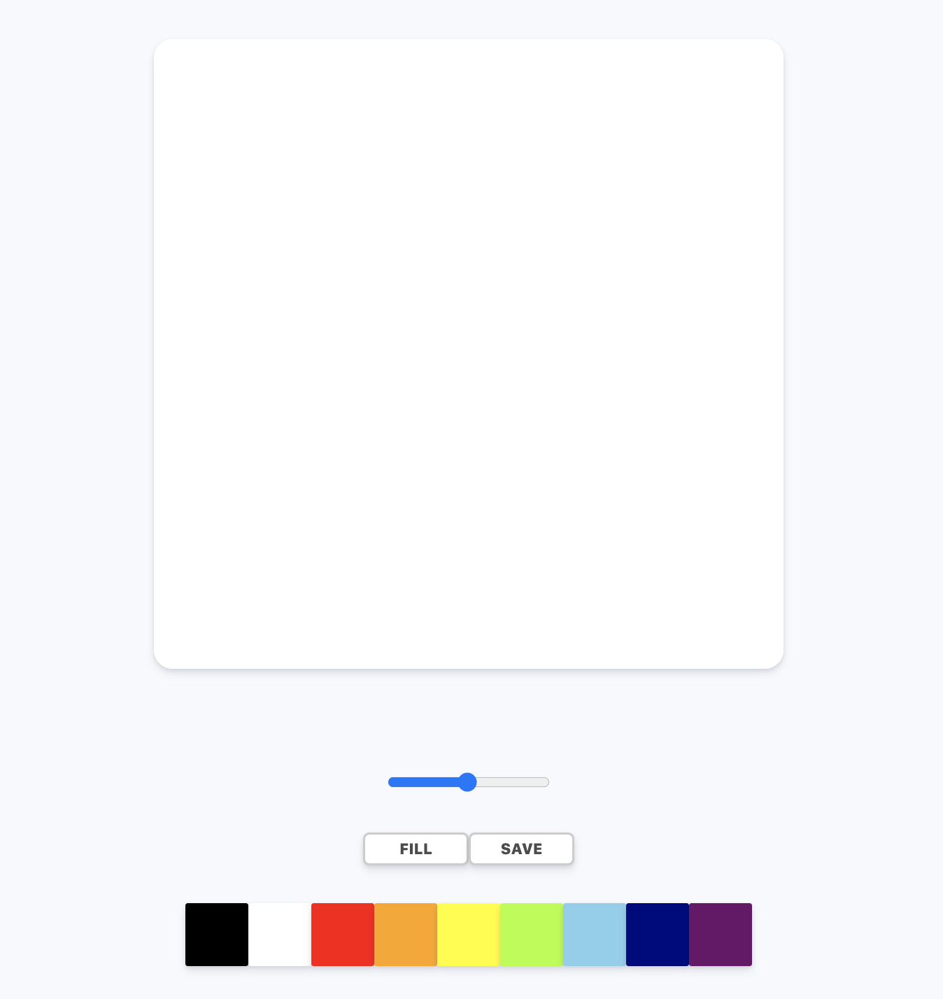

# PaintJS
Painting Board made with VanillaJS

### 구성요소
- 그림을 그릴 수 있는 Canvas
- 선의 색을 선택할 수 있는 색상 팔레트
- 선의 굵기를 조정할 수 있는 컨트롤
- 그림 그리기(paint)와 배경색 채우기(fill) 모드를 결정하는 버튼
- 이미지 저장 버튼

### 기능
- Canvas 내 움직이는 마우스 움직임을 인식
- 그림 그리기(paint) 모드에서는 마우스를 누르며 이동할 때 선 그리기
- 마우스를 떼거나 마우스가 Canvas 밖으로 나가면 중지
- 팔레트 내 색상 클릭 시 선 색상 변경
- 컨트롤 이동 시 크기에 맞게 선의 굵기 변경
- 배경색 채우기(fill) 모드 버튼 클릭 후 Canvas 클릭 시 전체 채우기
- 배경색 채우기(fill) 모드 버튼 클릭하면 그림 그리기(paint) 버튼으로 변경하기
- Canvas 내에서 사용자의 우클릭 방지
- Save 버튼 클릭시 Canvas 이미지 저장.

### References
- [reset css](https://meyerweb.com/eric/tools/css/reset/)
- [2D Context](https://developer.mozilla.org/en-US/docs/Web/API/CanvasRenderingContext2D)
- [이미지 저장 toDoURL()](https://developer.mozilla.org/en-US/docs/Web/API/HTMLCanvasElement/toDataURL)
